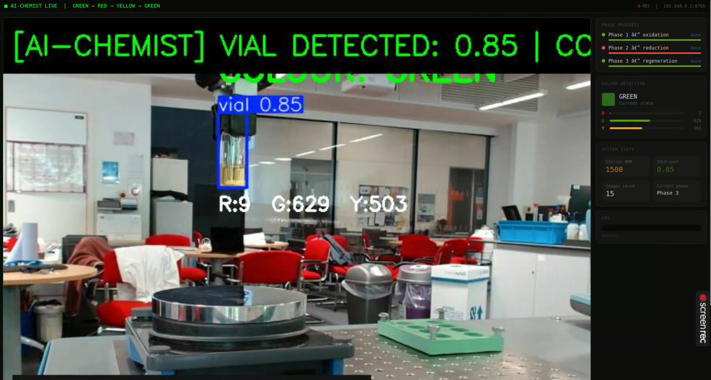
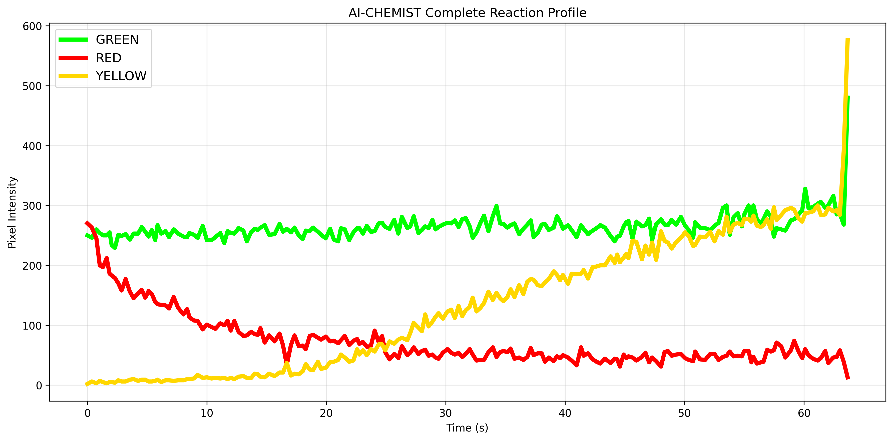

# 🧪 AI-Chemist Traffic Light

An autonomous robotic chemistry system that monitors and controls a three-phase oscillating colour reaction (GREEN → RED → YELLOW → GREEN) using a UR robot arm, YOLO-based vial detection, real-time colour analysis, and a live web dashboard.

> **Full cycle confirmed** — experiment run 2026-05-06, all three phases completed successfully.

---

# 🎬 Demo

## Dashboard Demo

```text
videos/final/dashboard_demo.webm
```
## Dashboard Screenshot



## Live Dashboard

The system streams a real-time MJPEG dashboard accessible through a browser:

```text
http://192.168.0.2:8765
```

---

# 🎯 What It Does

The system automates the classic traffic light reaction — a redox oscillator that cycles through three distinct colours. A UR robot arm picks up a vial, places it on an IKA stirrer, and the AI monitors the colour transition in real time using a camera and a YOLO model. Each phase is confirmed by stable colour detection before moving to the next.

```text
GREEN  ──►  RED  ──►  YELLOW  ──►  GREEN
(start)  (oxidation)  (reduction)  (regeneration)
```

The experiment runs autonomously once started, with the robot reacting in real time to visual information from the camera feed.

---

# 📊 Example Results

## Reaction Profile



| Phase | Transition | Success | Yield | Duration | Dominant |
|-------|-----------|---------|-------|----------|----------|
| 1 | GREEN → RED | ✅ YES | 66.8% | 2.8s | RED |
| 2 | RED → YELLOW | ✅ YES | 46.4% | 0.2s | YELLOW |
| 3 | YELLOW → GREEN | ✅ YES | 47.4% | 0.0s | GREEN |

**Full Cycle Complete: ✅ YES** — timestamp `2026-05-06 11:33:20`

See `results/SUMMARY.txt` for full metrics.

---

# 🗂️ Repository Structure

```text
AI-Chemist-Traffic-Light/
│
├── main_novel.py
│
├── handlers/
│   ├── __init__.py
│   ├── robot_handler.py
│   ├── camera_handler_2.py
│   ├── colour_detection.py
│   ├── ika_stirrer.py
│   ├── ai_chemist.py
│   ├── digital_twin.py
│   ├── reaction_analyzer.py
│   └── vlm_monitor.py
│
├── examples/
│   └── utils/
│       └── robotiq/
│           ├── robotiq_gripper.py
│           ├── robotiq_gripper_control.py
│           ├── robotiq_preamble.py
│           ├── rtde.py
│           ├── serialize.py
│           └── util.py
│
├── models/
│   └── best.pt
│
├── images/
│
├── videos/
│   └── final/
│       └── dashboard_demo.webm
│
├── results/
│   ├── ai_chemist_report.png
│   └── SUMMARY.txt
│
│
│
├── requirements.txt
├── .gitignore
└── README.md
```

---

# 🔧 Hardware Requirements

| Component | Details |
|-----------|---------|
| Robot arm | Universal Robots UR |
| Gripper | Robotiq 2F gripper |
| Camera | USB camera |
| Stirrer | IKA magnetic stirrer |
| Host machine | Ubuntu 24 + Python 3.10 |

Network requirement:

```text
192.168.0.x
```

Robot and host must be on the same subnet.

---

# 🚀 Quick Start

## 1. Clone Repository

```bash
git clone https://github.com/Spoorthi3011/AI-Chemist-Traffic-Light.git
cd AI-Chemist-Traffic-Light
```

---

## 2. Create Environment

```bash
conda create -n ai-chemist python=3.10
conda activate ai-chemist
```

---

## 3. Install Dependencies

```bash
pip install -r requirements.txt
```

---

## 4. Verify Hardware

```bash
python -c "import cv2; cap = cv2.VideoCapture(2); print(cap.isOpened())"

ls /dev/ttyACM*

fuser -k /dev/video2
```

---

## 5. Run the System

```bash
python main_novel.py
```

---

## 6. Open Dashboard

```text
http://192.168.0.2:8765
```

The dashboard displays the live camera feed, YOLO detections, colour transitions, phase tracking, system statistics, and experiment logs in real time.

---

# 🧠 AI Components

## YOLO Object Detection

The project uses a YOLO model to detect the vial in every frame.

Model file:

```text
models/best.pt
```

The model provides:
- vial localisation
- confidence scores
- ROI extraction for colour analysis

Colour detection only runs inside the YOLO bounding box, preventing interference from the background or lab environment.

---

## Colour Detection

Inside the vial bounding box, the system analyses:

- RED pixels
- GREEN pixels
- YELLOW pixels

A phase transition is only confirmed when:
- detected in consecutive frames
- held stable for ≥1.5 seconds
- tolerant to flicker noise

This prevents false triggers caused by reflections or motion.

---

## Digital Twin

The Digital Twin continuously logs:
- colour state
- timing data
- transition history
- experiment behaviour

At completion it generates:

```text
results/ai_chemist_report.png
```

---

## Reaction Analyzer

Calculates:
- phase durations
- colour dominance
- transition success
- reaction metrics

Outputs:

```text
results/SUMMARY.txt
```

---

## VLM Monitor

The system architecture includes a Vision-Language Monitoring module (`VLMMonitor`) designed to generate natural-language descriptions of the experiment directly from the camera feed.

The overlay pipeline and integration hooks are fully implemented inside the detection loop. Future work involves connecting live multimodal inference for autonomous scene narration and experiment interpretation.

---

## AI RPM Recommendation System

An `AIChemist` module was developed to dynamically recommend stirrer RPM values for each phase of the reaction.

The AI-generated RPM values were experimentally benchmarked against fixed hardcoded RPM values. In the current implementation, fixed RPM values produced more reliable experimental performance and were therefore retained.

This benchmarking process informed the final engineering design decisions.

---

# 🌐 Live Dashboard

The browser dashboard provides:
- live MJPEG stream
- YOLO bounding boxes
- colour labels
- pixel intensity bars
- phase progress tracking
- stirrer RPM display
- YOLO confidence values
- scrolling event logs

No GUI or monitor is required on the robot host machine.

---

# ⚙️ System Architecture

```text
main_novel.py
    │
    ├── StreamServer
    ├── enhanced_detection()
    │       ├── YOLO (best.pt)
    │       ├── ColourDetector
    │       └── VLMMonitor
    │
    ├── phase1_oxidation()
    ├── phase2_reduction()
    ├── phase3_regeneration()
    │
    ├── DigitalTwin
    ├── ReactionAnalyzer
    └── VideoRecorder
```

---

# 🧪 Experiment Workflow

## Phase 1 — Oxidation

```text
GREEN → RED
```

- Robot picks vial
- Inserts vial into stirrer
- Stirrer runs
- AI waits for RED confirmation

---

## Phase 2 — Reduction

```text
RED → YELLOW
```

- Robot repositions vial
- No stirring
- AI waits for YELLOW transition

---

## Phase 3 — Regeneration

```text
YELLOW → GREEN
```

- Stirrer runs at 1500 RPM
- AI waits for GREEN recovery
- Full cycle completes

---

# 📦 Requirements

```text
ultralytics>=8.0
opencv-python>=4.8
numpy>=1.24
pyserial>=3.5
```

Install:

```bash
pip install -r requirements.txt
```

> The deployment environment uses mambaforge with PyTorch from conda and system OpenCV.

---

# 📁 Runtime Outputs

Each experiment creates:

```text
OUTPUT/{timestamp}_AI_CHEMIST/
```

Containing:

```text
images/
videos/
reports/
```

Generated files include:
- annotated images
- confirmation snapshots
- experiment videos
- reaction graphs
- summary reports

---

# 🛑 Safe Shutdown

Press:

```text
Ctrl + C
```

The system safely:
1. stops stirrer
2. stops threads
3. saves video
4. saves reports
5. shuts down dashboard server

---

# 🔮 Future Work

Future development directions include:

- Full Vision-Language Model (VLM) integration for autonomous experiment narration
- AI-driven adaptive stirrer RPM optimisation
- Multi-vial and multi-reaction orchestration
- Cloud-based dashboard monitoring
- Automated reaction classification and anomaly detection
- Advanced Digital Twin analytics
- Dataset expansion for improved YOLO robustness
- Closed-loop chemistry experimentation
- Remote experiment monitoring and control

---

# 👥 Authors

## Group C — Robotics & AI Chemistry Lab

### Team Members
- Spoorthi J S
- Rishivardhan M M
- Grace Nicholson

---

## Academic Information

**University of Liverpool**  
**2025–26 — CHEM504: Robotics and Automation in Chemistry**

---

## Teaching Team

- **Teaching Assistant:** Hope McConnell
- **Lecturers:** John Ward, Gabriella Pizzuto
- **Robot Demonstrator:** Laura Jones

---

# 📜 License

MIT License
